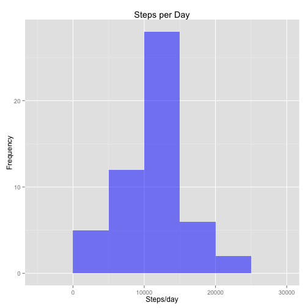
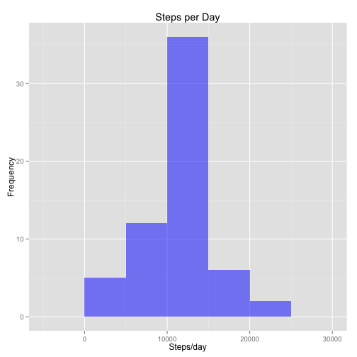
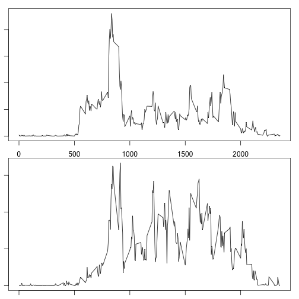

#Introduction

This assignment makes use of data from a personal activity monitoring device. This device collects data at 5 minute intervals through out the day. The data consists of two months of data from an anonymous individual collected during the months of October and November, 2012 and include the number of steps taken in 5 minute intervals each day.


#Data 

The variables included in this dataset are:

steps: Number of steps taking in a 5-minute interval (missing values are coded as NA)

date: The date on which the measurement was taken in YYYY-MM-DD format

interval: Identifier for the 5-minute interval in which measurement was taken

The dataset is stored in a comma-separated-value (CSV) file and there are a total of 17,568 observations in this dataset.

#Assignment 

##Loading and preprocessing the data

When you click the **Knit** button a document will be generated that includes both content as well as the output of any embedded R code chunks within the document. You can embed an R code chunk like this:


```r
library(dplyr)
library(plyr)
library(ggplot2)
library(knitr)

setwd("/Users/saran/reproduce")
fileUrl <- "https://d396qusza40orc.cloudfront.net/repdata%2Fdata%2Factivity.zip"
download.file(fileUrl,destfile="activity.zip",method="curl")
unzip(zipfile="./activity.zip")
```

#What is mean total number of steps taken per day?


```r
activity <- read.csv("activity.csv")
nrow(activity)
```

```
## [1] 17568
```

```r
nactivity <- filter(activity, !is.na(steps)) 
nrow(nactivity)
```

```
## [1] 15264
```

```r
head(nactivity)
```

```
##   steps       date interval
## 1     0 2012-10-02        0
## 2     0 2012-10-02        5
## 3     0 2012-10-02       10
## 4     0 2012-10-02       15
## 5     0 2012-10-02       20
## 6     0 2012-10-02       25
```

```r
stepsperday <- aggregate(steps ~ date, FUN=sum, data=nactivity)
g <- ggplot(stepsperday, aes(steps))
g <- g + geom_histogram(binwidth=5000,fill="blue",alpha=0.5)
g <- g + ggtitle("Steps per Day")
g <- g + labs(x="Steps/day" ,y="Frequency")
print(g)
```

 

```r
      meansteps <- mean(stepsperday$steps)
      meansteps
```

```
## [1] 10766.19
```

```r
      mediansteps <- median(stepsperday$steps)
      mediansteps
```

```
## [1] 10765
```

#What is the average daily activity pattern?

Make a time series plot (i.e. type = "l") of the 5-minute interval (x-axis) and the average number of steps taken, averaged across all days (y-axis)

Also find out 5-minute interval, on average across all the days in the dataset, which contains the maximum number of steps


```r
    avgsteps <- aggregate(steps ~ interval, FUN = mean, data=nactivity)
      plot(avgsteps,type="l")
```

 

```r
      avgsteps$interval[which.max(avgsteps$steps)]
```

```
## [1] 835
```
      
#Imputing missing values


```r
    sum(is.na(activity$steps))
```

```
## [1] 2304
```

```r
      sactivity <- activity
      nsteps <- is.na(sactivity$steps)
      sum(nsteps)
```

```
## [1] 2304
```

```r
      avginterval <- tapply(sactivity$steps,sactivity$interval,mean,na.rm=TRUE,simplify=TRUE)     #simplify=TRUE
      sactivity$steps[nsteps] <- avginterval[as.character(sactivity$interval[nsteps])]      
      sum(is.na(sactivity$steps))
```

```
## [1] 0
```

```r
      stepsperday <- aggregate(steps ~ date, FUN=sum, data=sactivity)
      g <- ggplot(stepsperday, aes(x=steps)) 
      g <- g + geom_histogram(binwidth=5000,fill="blue",alpha=0.5)
      g <- g + labs(title ="Steps per Day", x="Steps/day",y="Frequency")
      print(g)
```

 

```r
meansteps <- mean(stepsperday$steps)
meansteps
```

```
## [1] 10766.19
```

```r
mediansteps <- median(stepsperday$steps)
mediansteps
```

```
## [1] 10766.19
```

#Are there differences in activity patterns between weekdays and weekends?


```r
sactivity <- mutate(sactivity,wtype=ifelse(as.character(weekdays(as.Date(sactivity$date)))
                                            =="Saturday" |
                                             as.character(weekdays(as.Date(sactivity$date)))=="Sunday","Weekend","Weekday"))
head(sactivity)
```

```
##       steps       date interval   wtype
## 1 1.7169811 2012-10-01        0 Weekday
## 2 0.3396226 2012-10-01        5 Weekday
## 3 0.1320755 2012-10-01       10 Weekday
## 4 0.1509434 2012-10-01       15 Weekday
## 5 0.0754717 2012-10-01       20 Weekday
## 6 2.0943396 2012-10-01       25 Weekday
```

```r
sactivity$wtype <- as.factor(sactivity$wtype)

weekday <- subset(sactivity,wtype=="Weekday")
head(weekday)
```

```
##       steps       date interval   wtype
## 1 1.7169811 2012-10-01        0 Weekday
## 2 0.3396226 2012-10-01        5 Weekday
## 3 0.1320755 2012-10-01       10 Weekday
## 4 0.1509434 2012-10-01       15 Weekday
## 5 0.0754717 2012-10-01       20 Weekday
## 6 2.0943396 2012-10-01       25 Weekday
```

```r
weekend <- subset(sactivity,wtype=="Weekend")
head(weekend)
```

```
##      steps       date interval   wtype
## 1441     0 2012-10-06        0 Weekend
## 1442     0 2012-10-06        5 Weekend
## 1443     0 2012-10-06       10 Weekend
## 1444     0 2012-10-06       15 Weekend
## 1445     0 2012-10-06       20 Weekend
## 1446     0 2012-10-06       25 Weekend
```

```r
avgweekday <- aggregate(steps ~ interval, FUN=mean, data=weekday)
avgweekend <- aggregate(steps ~ interval, FUN=mean, data=weekend)

par(mfrow=c(2,1))
par(mar=c(1,1,1,1))
plot(avgweekday$interval,avgweekday$steps,type="l",xlab="",ylab="")
plot(avgweekend$interval,avgweekend$steps,type="l",xlab="",ylab="")
```

 

```r
dev.off()
```

```
## null device 
##           1
```


